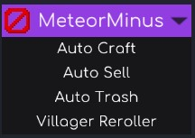
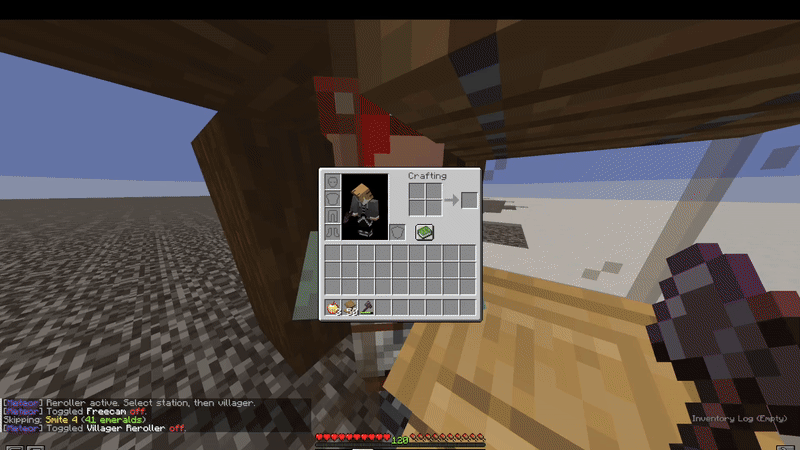
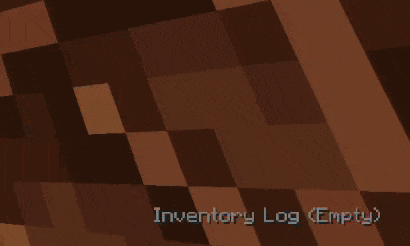
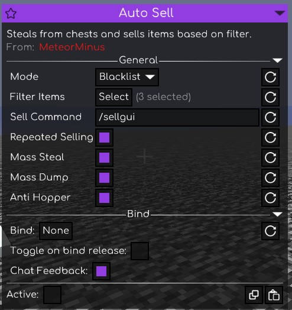
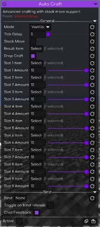

# MeteorMinus 

A utility addon for Meteor Client.

## Features



### Meteorminus Category
Adds a dedicated category to the Meteor Client GUI.

### Villager Reroller
Villager Auto Reroller that finds you the exact enchantments you are searching for.



### Inventory Log
Adds a new HUD option for meteor that shows inventory log.



### AutoTrash
Automates the process of clearing inventory using server-side trash commands.


### AutoSell
Automatically executes selling routines of full chests.



### AutoCraft
Automatically crafting items (Custom Recipes Are Supported!)




---

## Installation

1. Ensure Meteor Client is installed.
2. Place the addon .jar file into the `.minecraft/mods` folder.
3. Restart Minecraft.

---

## Requirements

* Minecraft (Fabric) 1.12.10
* Meteor Client
* Java Runtime Environment (JDK) 21

### Building from source
```bash
git clone [https://github.com/YourUsername/MeteorMinus.git](https://github.com/YourUsername/MeteorMinus.git)
cd MeteorMinus
./gradlew build
